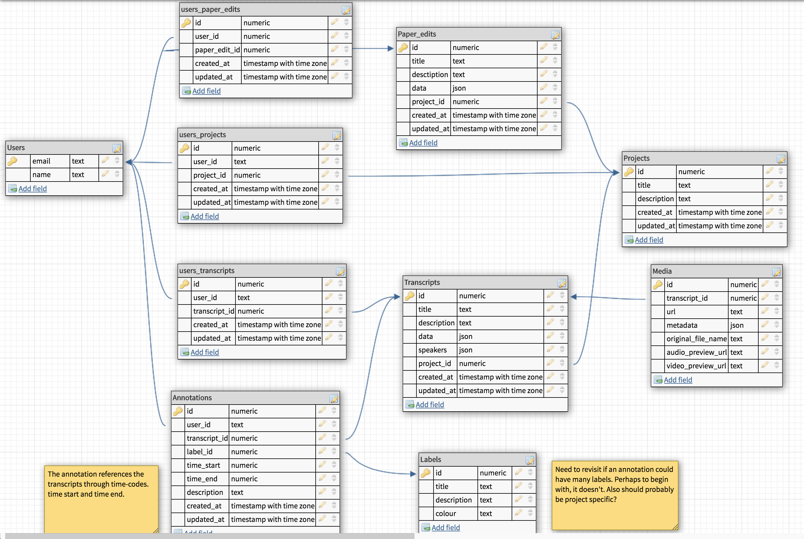

# SQL Database schema - draft

* Status: In progress <!-- optional -->
* Deciders: Pietro, Eimi <!-- optional -->
* Date: 2019-04-29 <!-- [YYYY-MM-DD when the decision was last updated]  optional -->

<!-- Technical Story: [description | ticket/issue URL] optional -->

## Context and Problem Statement

<!-- [Describe the context and problem statement, e.g., in free form using two to three sentences. You may want to articulate the problem in form of a question.] -->

A schema for the SQL database in PostgreSQL for the web app, to be reused for SQLite electron desktop version.

It should consider [the project Milestones](https://github.com/bbc/digital-paper-edit/milestones) and be easy to version incrementally. 
Eg have 3 version of the schema for the 3 main milestones:
- [Feature: Transcript Editing](https://github.com/bbc/digital-paper-edit/milestone/3)
- [Feature: Transcript Annotations](https://github.com/bbc/digital-paper-edit/milestone/4)
- [Feature: Paper Editing](https://github.com/bbc/digital-paper-edit/milestone/5)

[DB Designer](https://dbdesigner.page.link/cq9FMHVVxsYqTasf7) - let's you export SQL code to Create and drop tables.

## Decision Drivers <!-- optional -->

* easy to reason around
* easy to version and extend with subsequent migrations
* … <!-- numbers of drivers can vary -->

## Considered Options

_TBC_
<!-- * [option 1]
* [option 2]
* [option 3] -->
* … <!-- numbers of options can vary -->

## Decision Outcome

<!-- Chosen option: "[option 1]", because [justification. e.g., only option, which meets k.o. criterion decision driver | which resolves force force | … | comes out best (see below)]. -->
_TBC_

### Positive Consequences <!-- optional -->

<!-- * [e.g., improvement of quality attribute satisfaction, follow-up decisions required, …] -->
* …

_TBC_

### Negative consequences <!-- optional -->

<!-- * [e.g., compromising quality attribute, follow-up decisions required, …] -->
* …
_TBC_

## Pros and Cons of the Options 

_TBC_

<!-- 
### [option 1]

[example | description | pointer to more information | …] 

* Good, because [argument a]
* Good, because [argument b]
* Bad, because [argument c]
* … 

### [option 2]

[example | description | pointer to more information | …] 

* Good, because [argument a]
* Good, because [argument b]
* Bad, because [argument c]
* … 

### [option 3]

[example | description | pointer to more information | …] 

* Good, because [argument a]
* Good, because [argument b]
* Bad, because [argument c]
* …

## Links

* [Link type] [Link to ADR]  -->